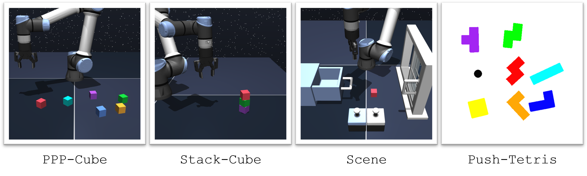
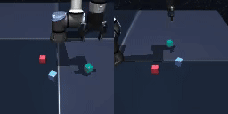
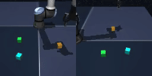
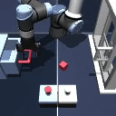
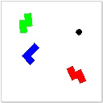
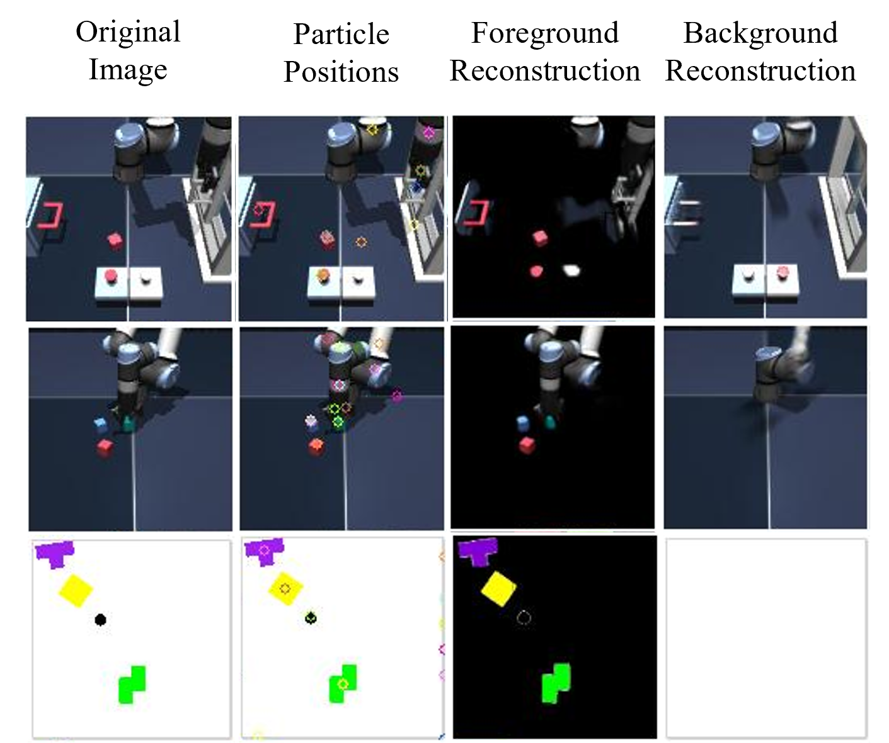

# Hierarchical Entity-Centric Reinforcement Learning (HECRL)

Official PyTorch code release of the paper "*Hierarchical Entity-centric Reinforcement Learning with Factored Subgoal Diffusion*" by Dan Haramati, Carl Qi,
Tal Daniel, Amy Zhang, Aviv Tamar and George Konidaris.

This repository is pytorch-based and incorporates torch.compile acceleration.

<h1 align="center">
  <br>
	Hierarchical Entity-centric Reinforcement Learning with Factored Subgoal Diffusion
  <br>
</h1>
  <h3 align="center">
    <a href="https://danhrmti.github.io/">Dan Haramati</a> •
    <a href="https://carl-qi.github.io/">Carl Qi</a> •
    <a href="https://taldatech.github.io/">Tal Daniel</a> •
    <a href="https://amyzhang.github.io/">Amy Zhang</a> •
    <a href="https://avivt.github.io/avivt/">Aviv Tamar</a> •
    <a href="https://cs.brown.edu/people/gdk/">George Konidaris</a>
  </h3>

<h3 align="center">ICLR 2026</h3>
<h4 align="center">World Modeling Workshop at Mila 2026 - Oral (top 7%)</h4>

<h3 align="center">
    <a href="https://sites.google.com/view/hecrl">Project Website</a> •
    <a href="https://www.arxiv.org/abs/2602.02722">arXiv</a> •
    <a href="https://openreview.net/forum?id=TimC6hxVHj">OpenReview</a>
</h3>

<p align="center">
  
</p>

> **Abstract** 
>
> *We propose a hierarchical entity-centric framework for offline Goal-Conditioned Reinforcement Learning (GCRL) that combines subgoal decomposition with factored structure to solve long-horizon tasks in domains with multiple entities.
Achieving long-horizon goals in complex environments remains a core challenge in Reinforcement Learning (RL). Domains with multiple entities are particularly difficult due to their combinatorial complexity. GCRL facilitates generalization across goals and the use of subgoal structure, but struggles with high-dimensional observations and combinatorial state-spaces, especially under sparse reward. We employ a two-level hierarchy composed of a value-based GCRL agent and a factored subgoal-generating conditional diffusion model. The RL agent and subgoal generator are trained independently and composed post hoc through selective subgoal generation based on the value function, making the approach modular and compatible with existing GCRL algorithms. We introduce new variations to benchmark tasks that highlight the challenges of multi-entity domains, and show that our method consistently boosts performance of the underlying RL agent on image-based long-horizon tasks with sparse rewards, achieving over $150\%$ higher success rates on the hardest task in our suite and generalizing to increasing horizons and numbers of entities.*

## Citation
Please consider citing our work if you find our paper or this repository useful.
>	
    @inproceedings{
    haramati2026hierarchical,
    title={Hierarchical Entity-centric Reinforcement Learning with Factored Subgoal Diffusion},
    author={Dan Haramati and Carl Qi and Tal Daniel and Amy Zhang and Aviv Tamar and George Konidaris},
    booktitle={The Fourteenth International Conference on Learning Representations},
    year={2026},
    url={https://openreview.net/forum?id=TimC6hxVHj}
    }

### Content

1. [Prerequisites and Environment Installation](#1-prerequisites-and-environment-installation)
2. [Environments](#2-environments)
3. [Datasets and Data Collection](#3-datasets-and-data-collection)
4. [Image Representation Checkpoints and Pretraining](#4-image-representation-checkpoints-and-pretraining)
5. [RL Training](#5-rl-training)
6. [Evaluation](#6-evaluation)
7. [Repository Content Summary](#7-repository-content)
8. [Credits](#credits)

## 1. Prerequisites and Environment Installation

The following are the main libraries required to run this code:

| Library             | Version |
|---------------------|---------|
| `python`            | `3.10`  |
| `pytorch`           | `2.10.0`|
| `tensordict`        | `0.11.0`|
| `torchrl`           | `0.11.1`|
| `ogbench`           | `1.2.1` |

For the full list of requirements, see the `requirements.txt` file.

## 2. Environments

<p align="center">
  
</p>

The above figure depicts the suite of training environments used in the paper, which were adapted from the *OGBench* benchmark and the PushT environemt introduced in *Diffusion Policy*.

`PPP-Cube`: based on the *OGBench Cube* environment, the agent is required to manipulate cubes between randomly initialized state and goal positions. Both state-based and multiview image observations (front and side) are supported. The accompanying dataset contains diverse agent-object interactions including **P**ick-**P**lace and **P**ush operations. \
`Stack-Cube`: identical to `PPP-Cube` except the dataset contains only Pick-and-Place operations with a high probability of stacking and the agent is only evaluated on stacking. \
`Scene`: We adopt the OGBench *Visual Scene* environment almost as is. \
`Push-Tetris`: we adapt the *Push-T* environment to multi-object manipulation of Tetris-like blocks. The agent is required to push the blocks to goal configurations including position and orientation. A dataset is collected using a random policy restricted to a fixed radius around an object, sampled at fixed time intervals, resulting in highly suboptimal behavior.

See paper for full details including the modifications from the original environments.

## 3. Datasets and Data Collection

<p align="center">
   &nbsp; &nbsp;
   &nbsp; &nbsp;
   &nbsp; &nbsp;
  
</p>

We provide the datasets used for RL training and (visual encoder training) at the [official Hugging Face dataset repository](https://huggingface.co/datasets/DanHrmti/hecrl).

These can be conveniently downloaded using the provided script:
```
# download all datasets (default)
python datasets/download_datasets.py

# download any subset of ['ppp-cube', 'stack-cube', 'visual-scene', 'push-tetris']
python datasets/download_datasets.py ppp-cube push-tetris  
```

This repository contains the data collection scripts to facilitate creating new datasets. `collect.py` is the main collection script. See `commands/collect.sh` for example commands.

## 4. Image Representation Checkpoints and Pretraining

<p align="center">
  
</p>

We provide the DLP and VQVAE model checkpoints and configs used in this work at the [official Hugging Face model repository](https://huggingface.co/DanHrmti/hecrl_visual_encoders).

These can be conveniently downloaded using the provided script:
```
# download all checkpoints
python visual_encoders/download_chkpts.py
```

This repository contains the representation training scripts to facilitate training on new collected datasets. See `commands/train_visual_encoder.sh` for example commands and further instructions.

## 5. RL Training

Train RL agents using `train.py`. See `commands/train.sh` for example commands.

When training SGIQL (our method) you may train the Subgoal Diffuser to convergence and then train the RL agent seperately with the resulting checkpoint using the `sgiql.load_pretrained_goal_pi` argument in `config.yaml`.

Log training statistics and images/videos using [Weights & Biases](https://wandb.ai/site) by filling in the appropriate arguments in `config.yaml`.

Agent model checkpoints and wandb data (if enabled) are saved in `output/train/<agent>_<task>_<seed>`.

>Notice that when running an image-based task for the first time, the entire dataset will be preprocessed to the latent image representations and saved as a seperate copy to the data folder which will be used directly for subsequent runs. For that first run, expect high memory usage and initial processing time, especially for the larger datasets.

## 6. Evaluation

Evaluate RL agents using `evaluate.py`. See `commands/eval.sh` for example commands.

Results are saved in `output/eval/`.

## 7. Repository Content Summary
| Filename           | Description                                                   |
|--------------------|---------------------------------------------------------------|
| `agents/`          | RL agents and architectures, including diffusion code         |
| `assets/`          | images and GIFs for this README                               |
| `commands/`        | example commands for data collection, training and evaluation |
| `common/`          | trainer, data buffer and utils                                |
| `datasets/`        | datasets and data collection code                             |
| `envs/`            | RL environments and associated wrappers                       |
| `visual_encoders/` | DLP and VQVAE code and checkpoints                            |
| `collect.py`       | main data collection script                                   |
| `config.yaml`      | config file for data collection, training and evaluation      |
| `evaluate.py`      | main evaluation script                                        |
| `train.py`         | main training script                                          |

## 8. Credits
* Repository structure inspired by [TD-MPC2](https://github.com/nicklashansen/tdmpc2)
* Cube and Scene Mujoco environments adapted from [OGBench](https://github.com/seohongpark/ogbench)
* Push-Tetris environment adapted from the [DINO-WM](https://github.com/gaoyuezhou/dino_wm) implementation of the Push-T environment introduced in [Diffusion Policy](https://github.com/real-stanford/diffusion_policy)
* RL code is based on [OGBench](https://github.com/seohongpark/ogbench) implementations and written in pytorch code modified from [LeanRL](https://github.com/meta-pytorch/LeanRL)
* Entity-centric RL and diffusion architectures adapted from [ECRL](https://github.com/DanHrmti/ECRL) and [EC-Diffuser](https://github.com/carl-qi/EC-Diffuser)
* DLP and VQVAE code is based on the implementations of [ECRL](https://github.com/DanHrmti/ECRL)
